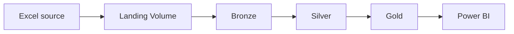

# ABR Car Data Platform

Data engineering project developed for ABR Car, a real car dealership, using Databricks, Unity Catalog, Delta Lake, and Medallion Architecture.

The project aims to build a reliable data ecosystem that organizes dealership data, improves data quality, and provides business metrics for operational and management decisions.

## Architecture



- **Landing:** preserves the source Excel files.
- **Bronze:** stores raw records with ingestion metadata.
- **Silver:** applies data quality, standardization, relationships, and incremental processing.
- **Gold:** provides business metrics and analytical datasets.
- **Power BI:** consumes only curated Gold tables.

## Technology Stack

- Databricks Free Edition
- Serverless compute
- Unity Catalog
- Python and Pandas
- PySpark
- Delta Lake
- SQL
- Power BI
- Git and GitHub

## Data Source

The initial development phase uses a fictitious Excel workbook designed according to the dealership's business context. It contains seven worksheets:

- `Vendedores`
- `Veiculos`
- `Captacoes`
- `Custos_Veiculos`
- `Vendas`
- `Historico_Status`
- `Atendimentos_Procuras`

The vehicle, identified by `id_veiculo`, is the main business entity.

The source workbook is not stored in this repository. It is uploaded to a governed Databricks Volume.

## Current Status

The initial environment setup and source inspection have been completed:

- Unity Catalog structure created.
- Landing Volume created.
- Excel file uploaded and accessed programmatically.
- Seven worksheets identified and validated.
- 1,244 source records inspected.
- Headers, dimensions, and completely empty rows checked.
- No Bronze tables created yet.

## Repository Structure

```text
abr-car-data-platform/
├── notebooks/
│   └── 01_setup_environment
├── README.md
└── requirements.txt
```

## Unity Catalog Structure

```text
abr_car_dev
├── landing
│   └── source_files
├── bronze
├── silver
├── gold
└── ops
```

## Next Steps

- Design the weekly snapshot strategy.
- Ingest each Excel worksheet into Bronze Delta tables.
- Add source and ingestion metadata.
- Apply data quality rules in Silver.
- Build relationships between business entities.
- Create Gold datasets and KPIs.
- Connect Power BI to the Gold layer.

## Project Scope

This project is being developed for a real car dealership. The current phase uses fictitious data to validate the architecture, ingestion process, data quality rules, relationships, and business metrics before the solution is adapted to the company's operational data.

The initial implementation focuses on a practical and maintainable architecture that can evolve according to the dealership's needs.